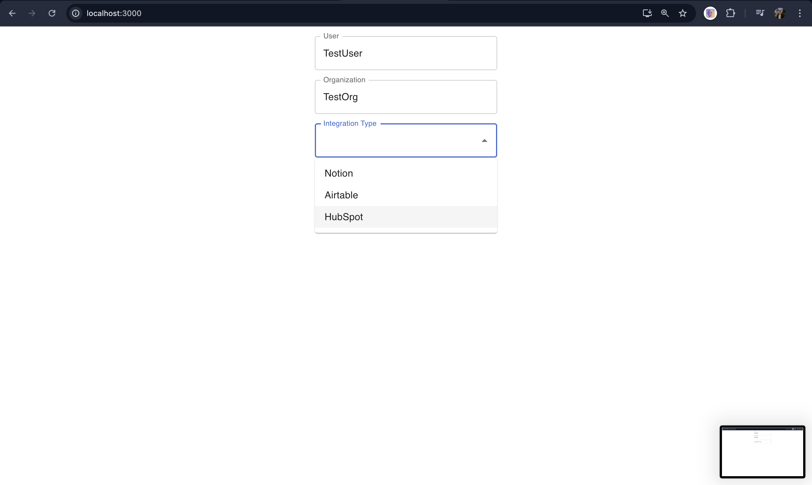
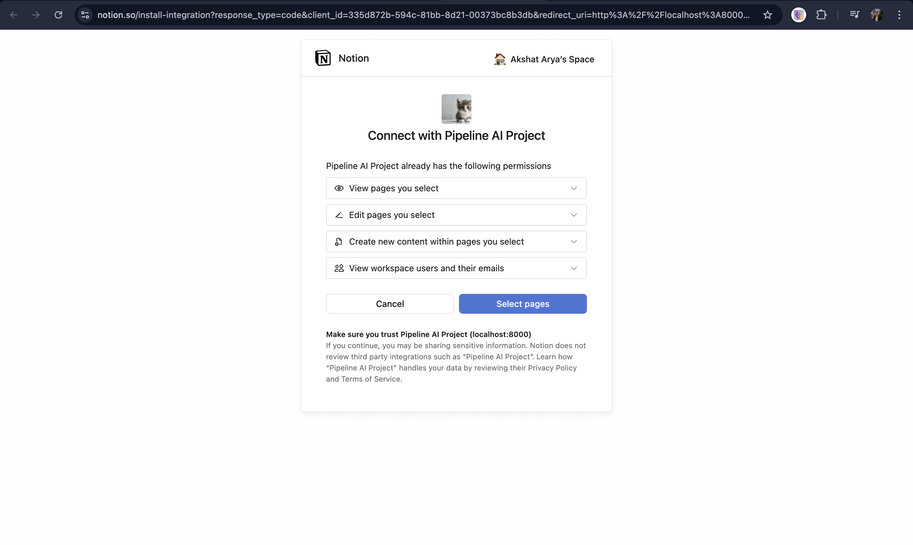
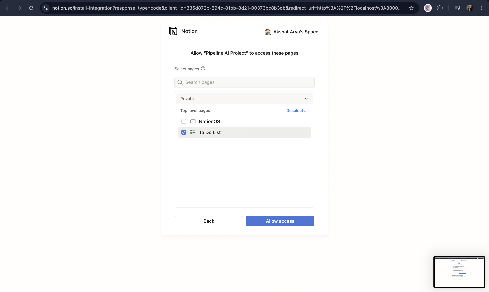
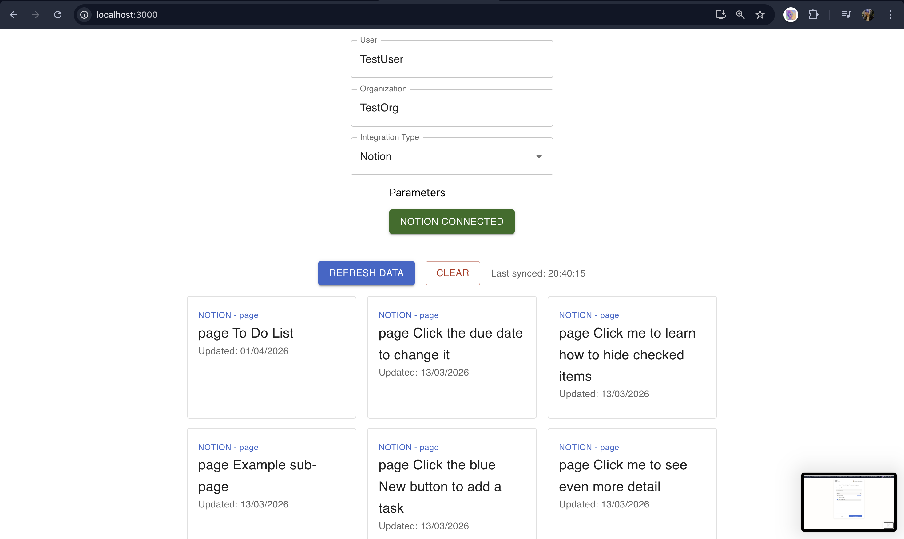
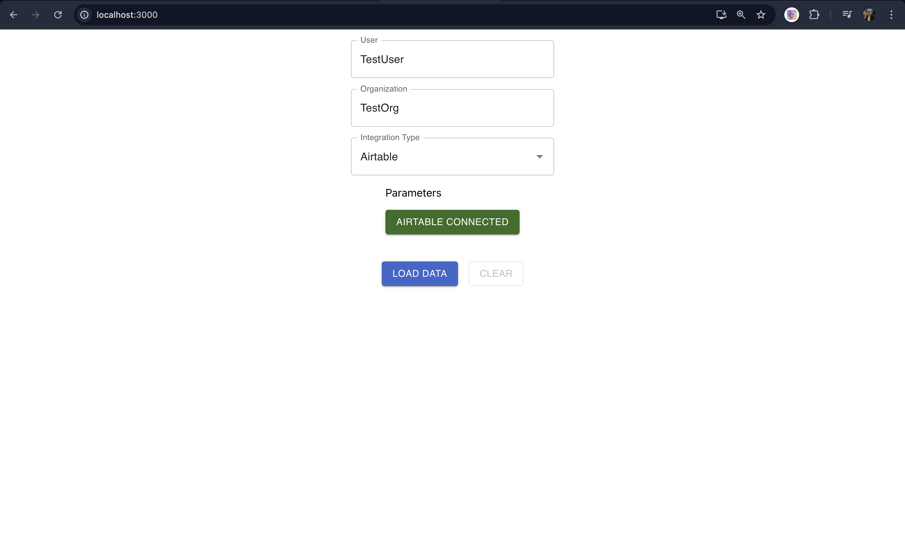
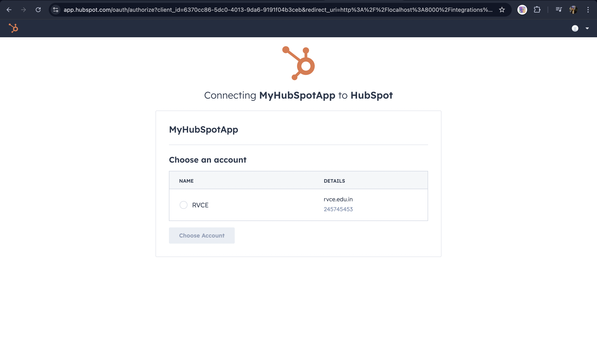

# SyncBridge 🌉

> **Unified Integration Platform** — Connect, Authenticate, and Sync Data Across HubSpot, Notion, and Airtable

SyncBridge is a full-stack integration platform that simplifies data synchronization across multiple business applications. With a clean, intuitive interface and secure OAuth authentication, connecting your tools has never been easier.

---

## 🎯 What is SyncBridge?

Managing data across different platforms is complicated. SyncBridge solves this by providing a **single unified interface** to connect with your favorite business tools:

- **HubSpot** — Sync contacts, companies, and deals from your CRM
- **Notion** — Access and organize your workspace databases
- **Airtable** — Retrieve bases and table data seamlessly

Whether you're a developer building integrations or a business user syncing data, SyncBridge makes it simple and secure.

---

## ✨ Features

✅ **Multi-Provider Integration** — Seamlessly connect to HubSpot, Notion, and Airtable  
✅ **Secure OAuth2 Authentication** — Enterprise-grade security with state validation  
✅ **Unified Data Display** — View all your data in a consistent, beautiful format  
✅ **Real-time Credential Management** — Safely store and retrieve credentials  
✅ **Async Processing** — Non-blocking operations for lightning-fast performance  
✅ **Redis Caching** — Quick credential retrieval with automatic expiry  
✅ **Developer-Friendly** — Well-documented code, easy to extend and customize

---

## 📸 Project Showcase

### Dashboard & Integration Selection



### HubSpot Integration Flow



### Data Loading & Display





### Notion Integration



### Airtable Integration



---

## 🚀 Quick Start

Get SyncBridge running in just 5 minutes! Here's how:

### Prerequisites

Before you begin, make sure you have:

- **Python 3.8+** — For the backend
- **Node.js 14+** — For the frontend
- **Redis** — For credential caching (optional, but recommended)
- **Git** — For cloning the repository

### Step 1: Clone & Navigate

```bash
git clone https://github.com/Arya-Akshat/SyncBridge.git
cd SyncBridge
```

### Step 2: Backend Setup

```bash
# Navigate to backend
cd backend

# Create a Python virtual environment
python3 -m venv .venv

# Activate it
source .venv/bin/activate  # On Windows: .venv\Scripts\activate

# Install dependencies
pip install -r requirements.txt

# Copy the environment template
cp .env.example .env
```

**Now edit `.env`** with your OAuth credentials from:
- [HubSpot Developers](https://developers.hubspot.com/)
- [Notion Integration Portal](https://www.notion.so/my-integrations)
- [Airtable Developer Console](https://airtable.com/developers/web/api)

### Step 3: Start Redis (Optional but Recommended)

```bash
# On macOS
brew services start redis

# On Linux
sudo systemctl start redis-server

# Or use Docker
docker run -d -p 6379:6379 redis
```

### Step 4: Frontend Setup

Open a new terminal:

```bash
# Navigate to frontend
cd frontend

# Install dependencies
npm install
```

### Step 5: Run Everything

**Terminal 1 — Backend:**
```bash
cd backend
source .venv/bin/activate
uvicorn main:app --reload --port 8000
```

**Terminal 2 — Frontend:**
```bash
cd frontend
npm start
```

**Ready!** Open [http://localhost:3000](http://localhost:3000) in your browser. 🎉

---

## 📋 How It Works

### The OAuth Flow

SyncBridge uses the industry-standard OAuth2 authorization code flow to securely connect with providers:

```
1. You select an integration (HubSpot, Notion, or Airtable)
2. Click "Connect" — opens a secure OAuth popup
3. Sign in with your provider account and grant permissions
4. SyncBridge securely exchanges the authorization code for an access token
5. Your token is encrypted and cached in Redis for quick retrieval
6. Click "Load Data" to fetch and display your information
```

**Security First:** State parameters are base64-encoded, tokens auto-expire, and credentials are never hardcoded. ✅

---

## 🏗️ Technology Stack

### Frontend
- **React 18** — Modern, component-based UI framework
- **Material-UI (MUI)** — Beautiful, professional components out of the box
- **Axios** — Simple, reliable HTTP client for API calls
- **Port:** 3000

### Backend
- **FastAPI** — Lightning-fast async Python framework
- **Uvicorn** — ASGI server for production-grade performance
- **httpx** — Non-blocking HTTP client for API calls
- **Redis** — In-memory caching for credentials and state
- **Port:** 8000

### Infrastructure
- **Redis (Optional)** — For credential and state caching on port 6379

---

## 📁 Project Structure

```
SyncBridge/
├── backend/
│   ├── main.py                          # FastAPI app entry point
│   ├── redis_client.py                  # Redis utilities
│   ├── requirements.txt                 # Python dependencies
│   ├── .env.example                     # Configuration template
│   └── integrations/
│       ├── hubspot.py                   # HubSpot OAuth & API
│       ├── notion.py                    # Notion OAuth & API
│       ├── airtable.py                  # Airtable OAuth & API
│       └── integration_item.py           # Unified data model
│
├── frontend/
│   ├── package.json
│   ├── public/
│   │   └── index.html
│   └── src/
│       ├── App.js                       # Main app component
│       ├── integration-form.js           # Provider selection
│       ├── data-form.js                 # Data display UI
│       ├── index.js                     # React entry point
│       └── integrations/
│           ├── hubspot.js               # HubSpot component
│           ├── notion.js                # Notion component
│           └── airtable.js              # Airtable component
│
├── images/                              # Project screenshots
├── README.md                            # This file
├── .env.example                         # Environment template
└── .gitignore                           # Git exclusions
```

---

## 🔌 API Endpoints

### HubSpot

| Endpoint | Method | Purpose |
|----------|--------|---------|
| `/integrations/hubspot/authorize` | POST | Start OAuth flow |
| `/integrations/hubspot/oauth2callback` | GET | Handle OAuth redirect |
| `/integrations/hubspot/credentials` | POST | Retrieve credentials |
| `/integrations/hubspot/load` | POST | Fetch CRM data |

### Notion

| Endpoint | Method | Purpose |
|----------|--------|---------|
| `/integrations/notion/authorize` | POST | Start OAuth flow |
| `/integrations/notion/oauth2callback` | GET | Handle OAuth redirect |
| `/integrations/notion/credentials` | POST | Retrieve credentials |
| `/integrations/notion/load` | POST | Fetch database data |

### Airtable

| Endpoint | Method | Purpose |
|----------|--------|---------|
| `/integrations/airtable/authorize` | POST | Start OAuth flow |
| `/integrations/airtable/oauth2callback` | GET | Handle OAuth redirect |
| `/integrations/airtable/credentials` | POST | Retrieve credentials |
| `/integrations/airtable/load` | POST | Fetch base data |

---

## 🔐 Environment Variables

Create a `.env` file in the `backend/` directory with these variables:

```bash
# HubSpot Configuration
HUBSPOT_CLIENT_ID=your_hubspot_client_id
HUBSPOT_CLIENT_SECRET=your_hubspot_client_secret
HUBSPOT_REDIRECT_URI=http://localhost:8000/integrations/hubspot/oauth2callback
HUBSPOT_SCOPES=crm.objects.contacts.read crm.objects.companies.read crm.objects.deals.read

# Notion Configuration  
NOTION_CLIENT_ID=your_notion_client_id
NOTION_CLIENT_SECRET=your_notion_client_secret
NOTION_REDIRECT_URI=http://localhost:8000/integrations/notion/oauth2callback

# Airtable Configuration
AIRTABLE_CLIENT_ID=your_airtable_client_id
AIRTABLE_CLIENT_SECRET=your_airtable_client_secret
AIRTABLE_REDIRECT_URI=http://localhost:8000/integrations/airtable/oauth2callback
AIRTABLE_SCOPES=data.records:read schema.bases:read

# Redis Configuration (Optional)
REDIS_HOST=localhost
```

---

## 🛠️ Development & Customization

### Adding a New Integration

Want to add another provider? It's simple:

1. Create a new file in `backend/integrations/` (e.g., `slack.py`)
2. Implement the OAuth flow using the existing integrations as a template
3. Create a corresponding component in `frontend/src/integrations/`
4. Wire it up in `backend/main.py` and `frontend/src/integration-form.js`

### Running Tests

```bash
cd backend
pytest
```

### Code Quality

We follow Python PEP 8 standards and JavaScript ES6+ best practices. The codebase is clean, well-documented, and easy to extend.

---

## ⚠️ Troubleshooting

### Port Already in Use?

```bash
# Kill processes on specific ports
lsof -ti :3000 | xargs kill -9    # Frontend
lsof -ti :8000 | xargs kill -9    # Backend
redis-cli shutdown               # Redis
```

### Redis Connection Error?

Make sure Redis is running:

```bash
# macOS
brew services start redis

# Linux
sudo systemctl start redis-server

# Docker
docker run -d -p 6379:6379 redis:latest
```

If you don't have Redis installed, credentials will still work (they'll just be stored temporarily).

### OAuth Scope Errors?

This usually means the credentials in your `.env` file don't have the required scopes configured in the provider's dashboard. Double-check:

1. Your CLIENT_ID and CLIENT_SECRET are correct
2. Scopes are space-separated in `.env`
3. The OAuth app is configured correctly in the provider's developer portal

### CORS Errors?

Ensure your frontend is on `http://localhost:3000` and backend on `http://localhost:8000`. If you change these ports, update the CORS settings in `backend/main.py`:

```python
origins = [
    "http://localhost:3000",  # Update this if needed
]
```

---

## 🎓 Architecture Highlights

### Why Async?

We use async/await throughout to ensure your UI never freezes. All API calls to providers happen non-blocking, so you can load data from multiple sources simultaneously.

### Credential Security

- OAuth tokens are never stored in your browser's localStorage
- Credentials are cached in Redis with automatic 10-minute expiry
- State parameters are base64-encoded with cryptographic signatures
- All communication uses HTTPS in production

### Data Unification

All integrations return data in a consistent format, making it easy to display multiple provider sources in the same UI:

```json
{
  "items": [
    {
      "id": "unique_id",
      "name": "John Doe",
      "type": "Contact",
      "created_at": "2024-01-15T10:30:00Z",
      "updated_at": "2024-01-16T14:20:00Z"
    }
  ]
}
```

---

## 📚 Learning Resources

- [FastAPI Documentation](https://fastapi.tiangolo.com/)
- [React Documentation](https://react.dev/)
- [OAuth 2.0 Specification](https://oauth.net/2/)
- [HubSpot API Docs](https://developers.hubspot.com/docs/api)
- [Notion API Docs](https://developers.notion.com/)
- [Airtable API Docs](https://airtable.com/developers/web/api)

---

## 🤝 Contributing

We'd love your contributions! Feel free to:

- Report bugs via GitHub Issues
- Suggest new integrations
- Improve documentation
- Submit pull requests with enhancements

---

## 📄 License

This project is part of the Pipeline AI technical assessment.

---

## 💬 Questions?

Feel free to open an issue on GitHub or reach out directly. Happy syncing! 🚀


